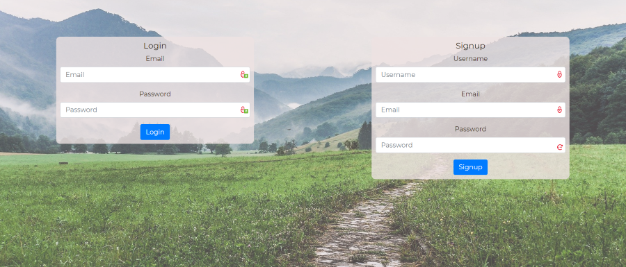
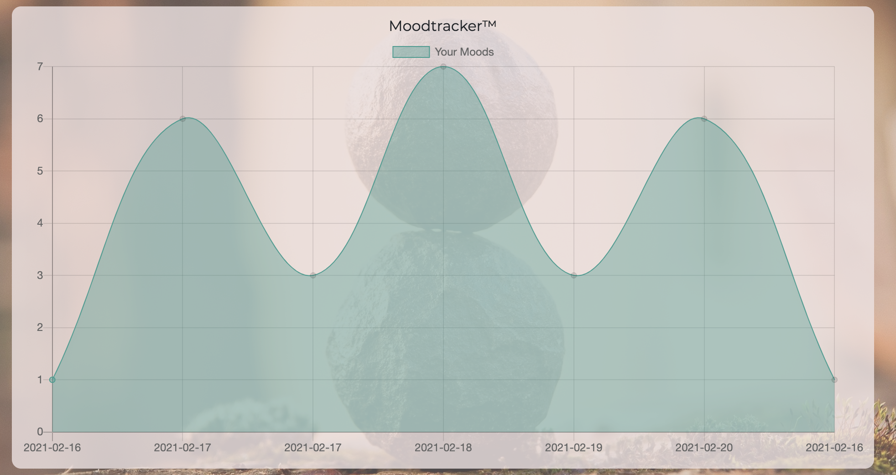

# **My-Wellness-Journey**   

An app to help you get and stay motivated on the path to wellness.   

Link to deployed site: **[My Wellness Journey](https://my-wellness-journey.herokuapp.com/)**

## **Table of Contents**

* *[Description](#description)*
* *[User-Story](#user-story)*
* *[Screenshots](#screenshots)*
* *[Installation](#installation)*
* *[Usage](#usage)*
* *[Support](#suport)*
* *[Roadmap](#roadmap)*
* *[Contributing](#contributing)*
* *[Technology](#technology)*
* *[Tests](#tests)*
* *[License](#license)*

## **Description**

My-Wellness-Journey is all about you.  Connecting a robust back-end to an interactive front-end, My-Wellness-Journey is a full stack application designed with your wellbeing front and center.  Keep track of and visualize your moods. Log on and get lighhearted reminders about staying hydrated.  Discover a new exercise or stretch that keeps your going through your busy day.  Not only do we value your health and happiness but your security online is also a top priority.  With secure user sessions, account protection and password encryption your visit to My-Wellness-Journey is sure to be just as private and safe as it is fun and fulfilling. 

## **User-Story**

```
AS AN exhausted boot camp student,
I WANT to see funny .Gifs,
SO THAT I am reminded to drink enough water throughout the day.

AS A stay-at-home parent,
I WANT to see data about me displayed intuitively,
SO THAT I can keep track of my moods, and my mental health.

AS AN office worker,
I WANT to do a quick exercise or stretch,
SO THAT I can recenter and refocus myself and return to work.
```

## **Screenshots**






## **Installation**

Use npm command:<br>
        `npm install`<br> 
To install necessary dependencies.

## **Usage**

1. To start the server in terminal:
    - `node server.js` or `npm start`
2. To quit server in terminal:
    - `CTRL+C`
3. To reset server after changes to database- In server.js change:
    - `force: false` to `force: true`
    - save the file and rerun step #1. 
    - Change: `force: true` back to `false`
    - save the file and rerun step #1. The server/database should now be live with  your changes.
4. If using seeds/seeds.js to test database structure and calls to front-end. In the terminal use the command:
    - `node seeds/seeds.js`


<br>

## **Support**

For any questions, comments, or feedback please feel free to reach out to our team members: <br>

| Team              | Email                            | Github                                    |
| :---              |            :----:                |                  :---:                    |
| Joseph Cosgrove   | **<jcosgrovecoding@gmail.com>**  | **[Github](https://github.com/jyc5331)**  |
| Kesiah Patil      | **<kesiahp18@gmail.com>**        | **[Github](https://github.com/kesiahp18)**|  
| Gintautas Stirbys | **<gint.stirbys@gmail.com>**     | **[Github](https://github.com/gintstir)** |     

<br>

## **Roadmap**
All great projects have room for improvement and innovation.  We are open to any and all feedback regarding tweaks and additions to this site.  Some elements that we have considered:
- Allow cross-user interaction in the form or viewing other user's moodtrackers and being able to leave positive reinforcement.
- Integrate a journaling feature.
- Implement other behavioral trackers such as water consumption/sleep etc. 

## **Contributing**

Please refer to the **[Contributor Covenant](https://www.contributor-covenant.org/)** for contribution guidelines.
<br>

## **Technology**


This project was completed using the following technologies, libraries, and software: 

- **[Node.js](https://nodejs.org/en/)**
- **[sequelize](https://www.npmjs.com/package/sequelize)**
- **[mySQL](https://www.npmjs.com/package/mysql2)**
- **[dotenv](https://www.npmjs.com/package/dotenv)**
- **[express](https://www.npmjs.com/package/express)**
- **[Insomnia](https://insomnia.rest/)**
- **[bcrypt](https://www.npmjs.com/package/bcrypt)**
- **[express-handlebars](https://www.npmjs.com/package/express-handlebars)**
- **[express-session](https://www.npmjs.com/package/express-session)**
- **[bootstrap](https://getbootstrap.com/)**
- **[connect-session-sequelize](https://www.npmjs.com/package/connect-session-sequelize)**
- **[Chart.js](https://www.chartjs.org/)**
- **[MySql Workbench](https://www.mysql.com/products/workbench/)**
- **[Heroku](https://www.heroku.com/home)**
<br>

## **Tests**

No test need to be run at this time. 


## **License**

Copyright © Joseph Cosgrove, Kesiah Patil, Gintautas Stirbys, 2021.  All Rights Reserved.

This Project is licensed under the **[Apache~2.0](https://www.apache.org/licenses/LICENSE-2.0)** license.